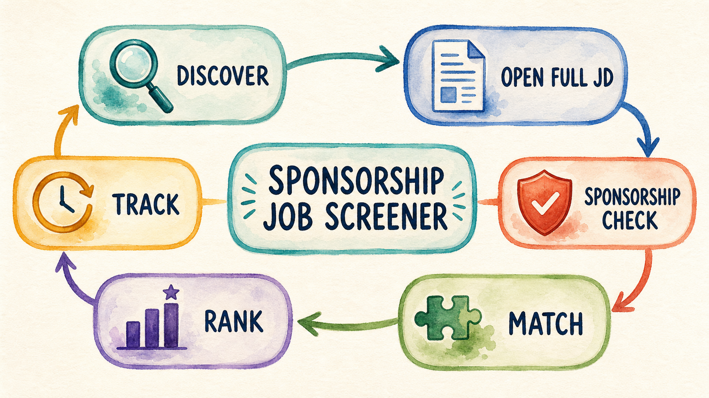
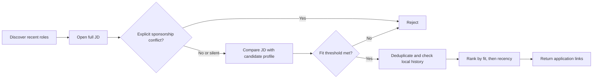

# Sponsorship Job Screener



An open-source agent skill that turns a broad job search into a smaller, application-ready shortlist. It discovers recent roles across job boards and employer career sites, removes explicit work-authorization conflicts, evaluates the full job description against a candidate profile, excludes high-volume LinkedIn Easy Apply routes when requested, and keeps a local history ledger so the same job is not shown twice.

The project addresses a common failure mode in sponsorship-dependent job searches: candidates spend substantial time opening roles that later disclose they cannot provide current or future sponsorship. This skill applies that constraint before detailed resume matching, reducing wasted effort and negative feedback without pretending that silence in a job description guarantees sponsorship.

## What it does

- Searches user-selected sources with one shared recency cutoff.
- Opens the full job description instead of judging fit from the title alone.
- Rejects explicit sponsorship denials and incompatible authorization requirements.
- Keeps sponsorship-silent roles and labels uncertainty honestly.
- Scores resume fit from responsibilities, must-haves, tools, domain, and seniority.
- Prefers employer or ATS application links and can exclude LinkedIn Easy Apply.
- Deduplicates cross-posted jobs and suppresses roles already presented, applied to, or skipped.
- Returns a ranked shortlist; it never submits an application.

## Workflow



The sponsorship rule is deliberately conservative: a current explicit denial is a hard veto, while a silent posting survives with an `unknown` signal. Historical H-1B activity may strengthen ranking, but it does not override the current posting or prove that a specific role will sponsor.

## Install

With GitHub CLI 2.90 or later:

```bash
gh skills install OWNER/sponsorship-job-screener sponsorship-job-screener
```

For a manual Codex installation, copy `skills/sponsorship-job-screener` into your local skills directory:

```bash
mkdir -p "${CODEX_HOME:-$HOME/.codex}/skills"
cp -R skills/sponsorship-job-screener "${CODEX_HOME:-$HOME/.codex}/skills/"
```

Keep your real resume, candidate profile, job descriptions, and history ledger outside this repository. Start from [`candidate-profile.example.md`](examples/candidate-profile.example.md), save the completed file in a private local directory, and point the agent to it in your prompt.

## Example prompt

> Use `$sponsorship-job-screener` to find US analyst roles posted in the last 72 hours across LinkedIn, Indeed, Glassdoor, and employer career pages. Exclude LinkedIn Easy Apply. Reject explicit current-or-future sponsorship denials, compare each full JD with my private candidate profile, suppress jobs in my local history ledger, and return up to 25 roles ranked by fit and then recency. Do not apply.

## Sponsorship decision policy

| Current evidence | Decision |
|---|---|
| Explicitly no current or future sponsorship | Reject |
| Permanent unrestricted authorization required | Reject |
| Incompatible citizenship or clearance requirement | Reject or candidate-specific verification |
| Conditional or case-by-case sponsorship | Keep and verify |
| Explicit sponsorship support | Keep and rank higher |
| No sponsorship language | Keep as unknown |

E-Verify participation, OPT acceptance, and historical H-1B filings are useful signals, but none independently proves future sponsorship for a specific opening.

## Included utilities

The skill bundles three dependency-free Python utilities:

- `screen_jd.py` extracts sponsorship and work-authorization signals from JD text.
- `manage_history.py` prevents repeat recommendations using a user-chosen local JSON ledger.
- `render_shortlist.py` sorts qualifying jobs by fit and recency and can render Markdown, HTML, or CSV.

Run the tests from the skill directory:

```bash
python3 -m unittest discover -s scripts -p 'test_*.py'
```

## Privacy and safety

This public repository contains no real resume, candidate identity, immigration timeline, job-search history, browser session, credential, or application record. Runtime data is local by design and ignored by Git. The skill must never request passwords, cookies, session tokens, authorization headers, or complete authenticated network requests. It respects authentication boundaries, CAPTCHAs, site access controls, and platform terms.

Before publishing a fork, run the included privacy scan:

```bash
python3 tools/privacy_scan.py .
```

## Limitations

This is an agent workflow plus deterministic screening helpers, not an unattended crawler. Coverage depends on pages the user can lawfully access, job-board availability, and the agent's browsing tools. Regex results are triage signals rather than legal or immigration advice, and every selected role should be checked again before applying.

## Attribution and license

This project is adapted in part from GitHub's [`technical-job-search`](https://github.com/github/awesome-copilot/tree/main/skills/technical-job-search) skill in [`github/awesome-copilot`](https://github.com/github/awesome-copilot). See [NOTICE](NOTICE) for attribution. The repository is licensed under the [MIT License](LICENSE).
